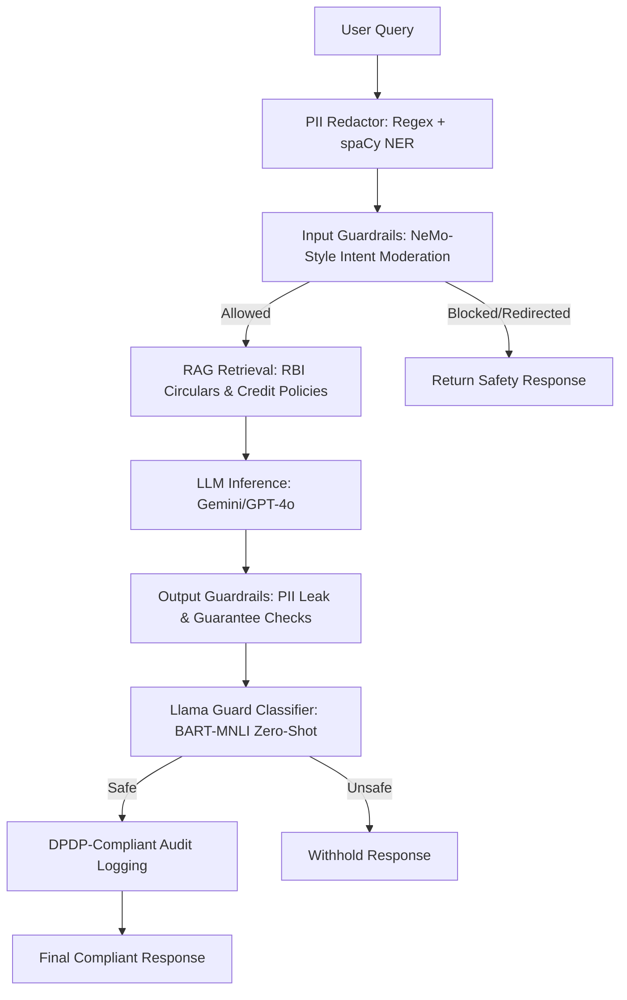

# FinanceGuard AI — CreditLens Production Pipeline with Safety Guardrails

This folder contains the implementation of a hardened production pipeline for **CreditLens**, FinanceGuard AI's credit policy assistant, configured with a complete pre-processing and post-processing safety stack.

The pipeline is fully compliant with the regulatory guidelines of the Reserve Bank of India (RBI) and India's Digital Personal Data Protection (DPDP) Act 2023.

---

## 🏗️ System Architecture

The pipeline processes natural language queries from loan officers using the following stages:



---

## 🛠️ Features & Tasks Implemented

### Core Tasks
1. **LangChain Safety RAG Pipeline**: An end-to-end pipeline indexing RBI circulars, internal product guides, and DPDP guidelines using a FAISS vector store.
2. **NeMo-Style Guardrails**: An input and output rules engine verifying off-topic attempts, jailbreak queries, PII leakage, and absolute financial guarantee claims.
3. **Llama Guard Output Classifier**: Emulated via a zero-shot `facebook/bart-large-mnli` text classification pipeline categorizing and filtering unsafe financial guidance, product misinformation, and privacy risks.
4. **spaCy NER PII Redactor**: A two-stage redactor using strict Regex patterns for structured data (Aadhaar, PAN, phone numbers) and spaCy NER for unstructured PII (customer names, locations, bank names), with a robust fallback engine in case of package/DLL issues.
5. **Telemetry & Dashboard Logging**: Logs latency, tokens, cost, and safety status. Outputs summary dashboard visualizations (`metrics_dashboard.png`).

### Extension Tasks
* **Ext 1: LlamaIndex Retrieval Comparison**: Swaps LangChain with LlamaIndex (BGE embeddings) and compares document chunk retrieval overlap across a standard query suite.
* **Ext 2: LangGraph Human-in-the-Loop Workflow**: Implements underwriting escalation routing, queuing applications exceeding INR 10 Lakhs or risk thresholds for human approval.
* **Ext 3: Cost Benchmarking**: Performs a financial cost projection model for 80,000 daily queries comparing GPT-4o, Gemini 1.5 Flash, and self-hosted Llama-3, saving results to `cost_comparison.png`.
* **Ext 4: FastAPI Deployment with Rate Limiting**: Deploys an API endpoint `/api/v1/query` with an IP-based token-bucket style rate limiting validator (tested with FastAPI `TestClient` to assert HTTP 429 triggers).
* **Ext 5: DPDP-Compliant Audit Schema**: Serializes audit trails capturing data consent references, purpose limitation, explainability telemetry, and logs compliance with a cryptographic HMAC-SHA256 signature to prevent tampering.

---

## ⚙️ Configuration & Run Instructions

### 1. API Key Configuration
Create a `.env` file in this directory to load the Gemini API key:
```env
GEMINI_API_KEY=your_gemini_api_key_here
```
*Note: If no API keys are configured, the pipeline automatically runs in simulated/mock mode.*

### 2. Execution
Run the complete benchmarking and safety tests using the workspace virtual environment:
```powershell
.venv\Scripts\python.exe eytraining/day14/lab2/financeguard_safety_pipeline.py
```

### 3. Generated Artifacts (in `output/` folder)
* `pipeline_metrics.csv`: Telemetry sheet of all runs.
* `dpdp_audit_log.json`: Signed audit trail log.
* `metrics_dashboard.png`: Matplotlib charts for latency, costs, and query actions distribution.
* `cost_comparison.png`: Projected monthly LLM operational budget comparison.
