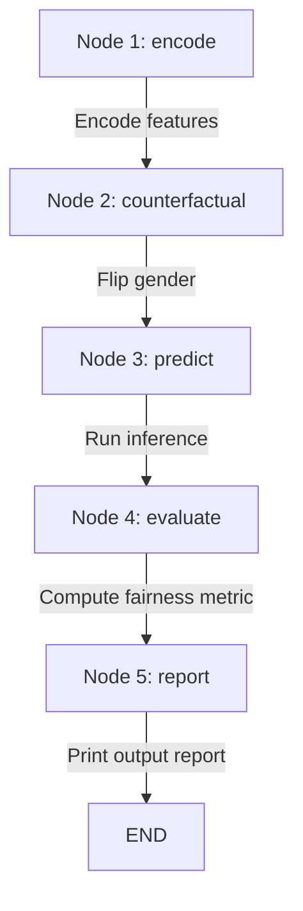

# ⚖️ Day 15: Counterfactual Fairness Production Pipeline

Evaluating bias and fairness in machine learning loan approval models using LangGraph and Scikit-Learn.

## Overview

Counterfactual fairness is an evaluation technique that tests whether changing a protected attribute (such as gender) modifications the model's decision while keeping all other inputs identical. 

The core question we answer is:
> **"Would this loan applicant receive a different decision if only their gender changed?"**

In a fair model, the decision (approved vs. rejected) should remain identical.

## Architecture

This pipeline is modeled as a state machine using **LangGraph**. The workflow progresses sequentially through 5 nodes:



| Node | Responsibility |
|---|---|
| **encode** | Label encoding and feature preparation on the raw dataset |
| **counterfactual** | Create gender-flipped applicant profiles (0 → 1 or 1 → 0) |
| **predict** | Standardize features using the fit scaler and run model inference |
| **evaluate** | Compute the percentage of decisions that changed upon gender flipping |
| **report** | Generate explainable output text, sample flipped decisions, and assign a verdict |

## Getting Started

### 1. Installation
Ensure all dependencies are installed:
```bash
pip install pandas scikit-learn langgraph
```

### 2. Run the Evaluation
Execute the production pipeline script:
```bash
python task1/extension_2_production_pipeline.py
```

## Interpreting Results

* **Verdict**: If the percentage of flipped decisions is **greater than 5%**, the model is flagged as `❌ NOT counterfactually fair`, indicating that gender holds too much influence over the predictions. Otherwise, it is flagged as `✅ Approximately counterfactually fair`.
