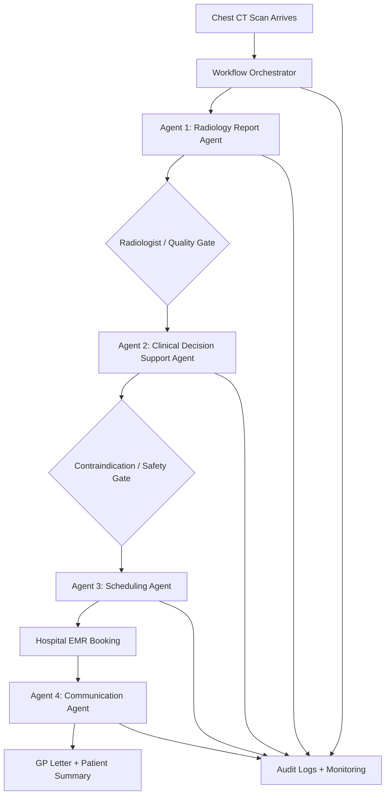
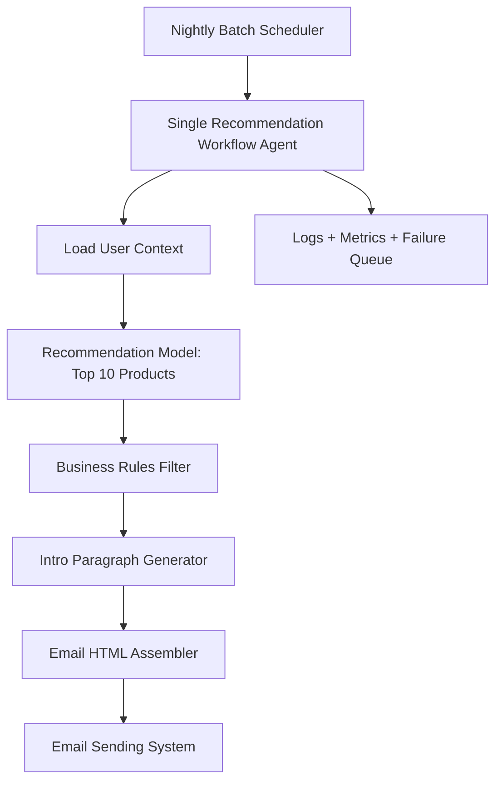
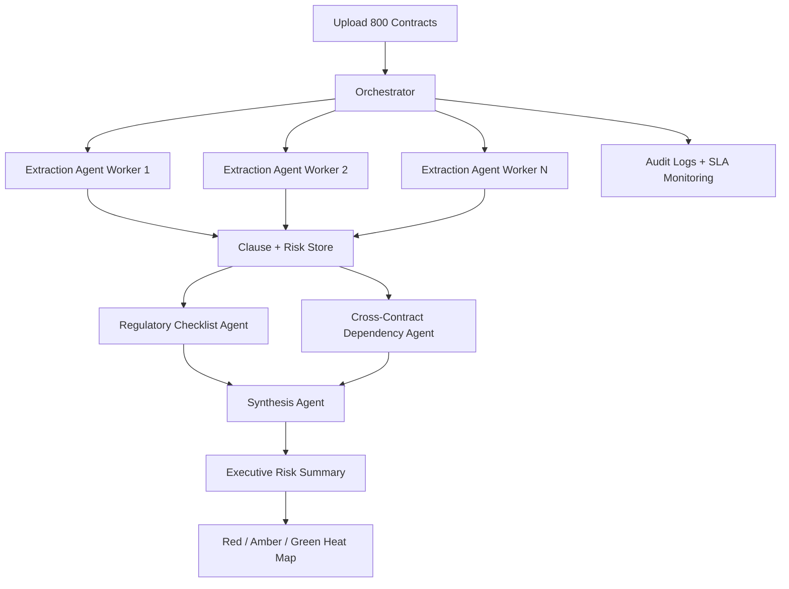
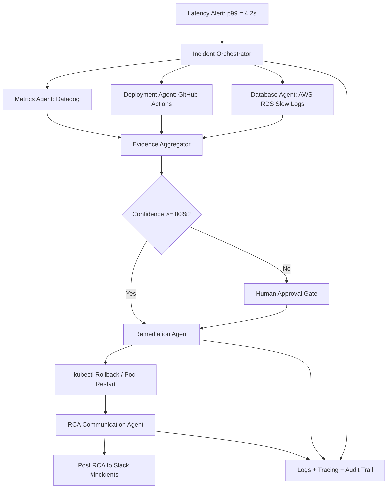

# Architecture Choice Answers: Single Agent vs Multi-Agent
# Question 1: Healthcare / Clinical AI - Apollo Diagnostics
**Automated radiology report + care pathway**

Apollo wants to automate the end-to-end workflow when a chest CT scan arrives:

1. A radiologist-grade model reads the scan and drafts a findings report.
2. A clinical-decision-support system cross-checks findings against the patient's medication history for contraindications.
3. A scheduling agent books the recommended follow-up, for example biopsy or PET scan, in the hospital's EMR.
4. A communication agent drafts the GP letter and patient-facing summary.

Each step has a distinct tool, knowledge domain, and failure mode.

Tags: **4 distinct domains**, **Sequential with gates**, **Different tool access**

**Which architecture would you choose?**

## Chosen Architecture

**Multi-agent architecture**

## Justification

This should be **multi-agent** because every step needs a different skill and tool:

- The scan-reading step needs radiology knowledge.
- The medication-check step needs clinical safety checks.
- The scheduling step needs EMR access.
- The communication step needs different writing formats for doctor and patient.

It is also a healthcare workflow, so every major step should have validation, audit logs, and human approval where needed. A single agent would be risky because one mistake can affect diagnosis, follow-up, or patient communication.

## Tentative Block Diagram

---

# Question 2: E-Commerce / Retail - ShopIQ

## Full Question

**Personalised product recommendation email**

ShopIQ runs a nightly batch job to send personalised recommendation emails to 4 million users. For each user:

1. Pull their 6-month purchase and browse history.
2. Run a collaborative-filtering model to get top-10 candidates.
3. Apply business rules, such as exclude out-of-stock and exclude recently-purchased items.
4. Write a short personalised intro paragraph.
5. Assemble the email HTML.

The model call, rules, copywriting, and assembly all use the same user context object and must complete in under 3 seconds per user.

Tags: **Batch: 4M users**, **Shared user context**, **< 3s per user**

**Which architecture would you choose?**

## Chosen Architecture

**Single-agent architecture**

## Justification

This should be a **single-agent / single workflow service** because all steps use the same user context and follow a fixed order.

The main goal is speed and scale. For 4 million users, adding multiple agents would create extra coordination overhead and increase latency. A single workflow can call tools/models in order and finish faster.

Business rules and email assembly are mostly deterministic, so they do not need separate agents.

## Tentative Block Diagram

---

# Question 3: Legal / LegalTech - ContractIQ

## Full Question

**M&A due diligence on 800 contracts**

A PE firm uploads 800 supplier and employment contracts ahead of an acquisition. ContractIQ must:

1. Extract key obligations and risk clauses from each document, parallelisable across contracts.
2. Cross-reference extracted clauses against a jurisdiction-specific regulatory checklist.
3. Identify inter-contract dependencies, for example change-of-control clauses that cascade.
4. Produce an executive risk summary with a red/amber/green heat map.

Total turnaround required: under 4 hours. Documents are independent at the extraction stage but interdependent at the synthesis stage.

Tags: **800 docs, parallel**, **Cross-doc synthesis**, **4-hour SLA**

**Which architecture would you choose?**

## Chosen Architecture

**Multi-agent architecture**

## Justification

This should be **multi-agent** because extraction can run in parallel across many documents, but final reasoning needs cross-document synthesis.

A good design is to use separate agents for:

- Contract clause extraction.
- Regulatory checklist validation.
- Cross-contract dependency detection.
- Executive risk summary creation.

This is better than a single agent because 800 contracts are too many for one agent to process quickly and reliably. Multi-agent design also makes the output easier to audit.

## Tentative Block Diagram

---

# Question 4: DevOps / Platform Engineering - CloudOps Sentinel

## Full Question

**Incident triage and auto-remediation**

An alert fires: p99 API latency has spiked to 4.2s on the payments service. CloudOps Sentinel must:

1. Query metrics in Datadog to identify which pods are degraded.
2. Check recent deployment logs in GitHub Actions for a root cause.
3. Query the DB slow-query log in AWS RDS.
4. If confident, execute a rollback or pod restart via kubectl.
5. Post a structured RCA to the #incidents Slack channel.

Steps 1 to 3 can run concurrently. Step 4 requires human approval if confidence is below 80%. Step 5 always runs last.

Tags: **Concurrent sub-investigations**, **Human-in-the-loop gate**, **Different tool surfaces**

**Which architecture would you choose?**

## Chosen Architecture

**Multi-agent architecture**

## Justification

This should be **multi-agent** because different investigations can run at the same time and each one uses a different tool.

- One agent checks Datadog metrics.
- One agent checks GitHub Actions deployment logs.
- One agent checks AWS RDS slow queries.
- One remediation agent handles rollback or restart.
- One communication agent posts the final RCA to Slack.

The remediation step is risky, so it needs a confidence score and human approval gate. Multi-agent architecture is better here because it allows faster investigation, safer action, and clearer responsibility for each step.

## Tentative Block Diagram

---

# Final Summary

| Scenario | Best Choice | Main Reason |
|---|---|---|
| Healthcare radiology report + care pathway | Multi-agent | Different clinical domains, tools, and safety gates |
| Personalised product recommendation email | Single-agent | Same user context, fixed flow, strict speed requirement |
| M&A due diligence on 800 contracts | Multi-agent | Parallel document processing and cross-document synthesis |
| Incident triage and auto-remediation | Multi-agent | Concurrent investigations, different tools, and human approval gate |

