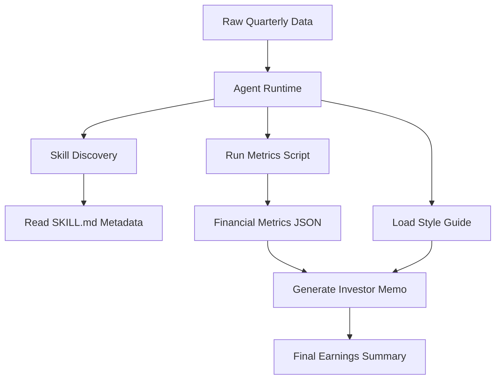

# Claude Skill Demo - Financial Services

This topic demonstrates the idea of a reusable skill for financial-services reporting. The skill converts raw quarterly figures into a consistent investor update memo.

## Skill Structure

```text
earnings-summary/
├── SKILL.md
├── scripts/
│   └── finance_metrics.py
└── references/
    └── style_guide.md
```

## What Each Part Does

| Component | Purpose |
| --- | --- |
| `SKILL.md` | Describes when the skill should be used and how the assistant should behave |
| `finance_metrics.py` | Calculates deterministic metrics such as growth, margin, and EPS |
| `style_guide.md` | Provides memo format, tone, and writing rules |
| Agent runtime | Discovers the skill and calls the right files/tools |

## Workflow



## Metrics Example

The deterministic script can calculate:

- Revenue growth percentage
- Net margin percentage
- Earnings per share
- Basic performance indicators

The model then uses those metrics, plus the style guide, to write a polished memo.

## Why Skills Are Useful

Skills help separate reusable domain instructions from one-off prompts. They are useful when a team wants repeatable output structure, deterministic calculations, and references that are loaded only when needed.
