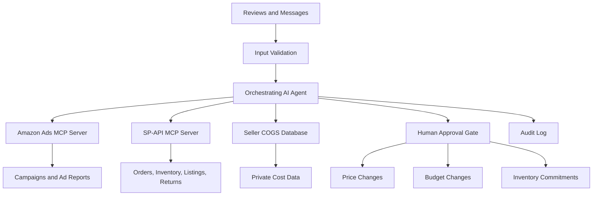

# Amazon Seller MCP Case Study

This note outlines a high-level MCP design for an AI assistant that helps an Amazon seller with ads, inventory, pricing, orders, and profitability.

## Core Architecture

## Main Design Decisions

| Area | Decision | Reason |
| --- | --- | --- |
| Topology | One orchestrating agent with multiple MCP servers | Ads, selling-partner operations, and private cost data live in different systems |
| Discovery | Use pinned, known MCP servers | Reduces the risk of untrusted tool registration |
| Authorization | Apply least privilege | The agent should only access the actions required for the task |
| Credentials | Keep service credentials separate | Prevents one integration from exposing another integration |
| Human approval | Require approval for money-impacting actions | Price changes, campaign launches, and budget increases carry business risk |
| State | Support asynchronous jobs | Reports and exports may take time to complete |
| Rate limits | Add quota-aware throttling | Prevents API limit errors and unstable automation |
| Security | Treat customer text as untrusted input | Reviews and messages can contain prompt injection attempts |
| Governance | Log tool calls and approvals | Supports troubleshooting, compliance, and accountability |

## Trust Boundaries

The design should separate:

- Amazon-hosted systems, such as Ads data and campaign tools.
- Seller-controlled systems, such as private COGS and internal analytics.
- Restricted customer data, especially PII from orders or messages.

## Automation Rules

Safe autonomous actions:

- Read inventory levels.
- Generate reports.
- Monitor ad spend.
- Calculate profitability using private cost data.

Approval-required actions:

- Change prices.
- Increase ad budgets.
- Launch campaigns.
- Make inventory commitments.
- Access or export sensitive customer data.

## Final Principle

Use one coordinating agent, several narrowly scoped MCP servers, strict trust boundaries, and human approval for high-risk actions.
