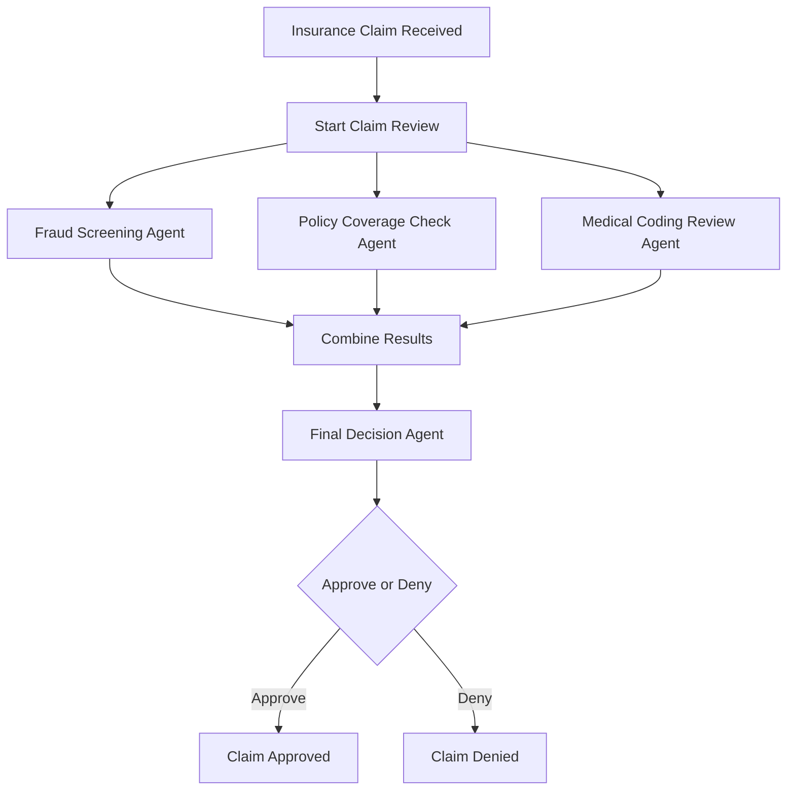
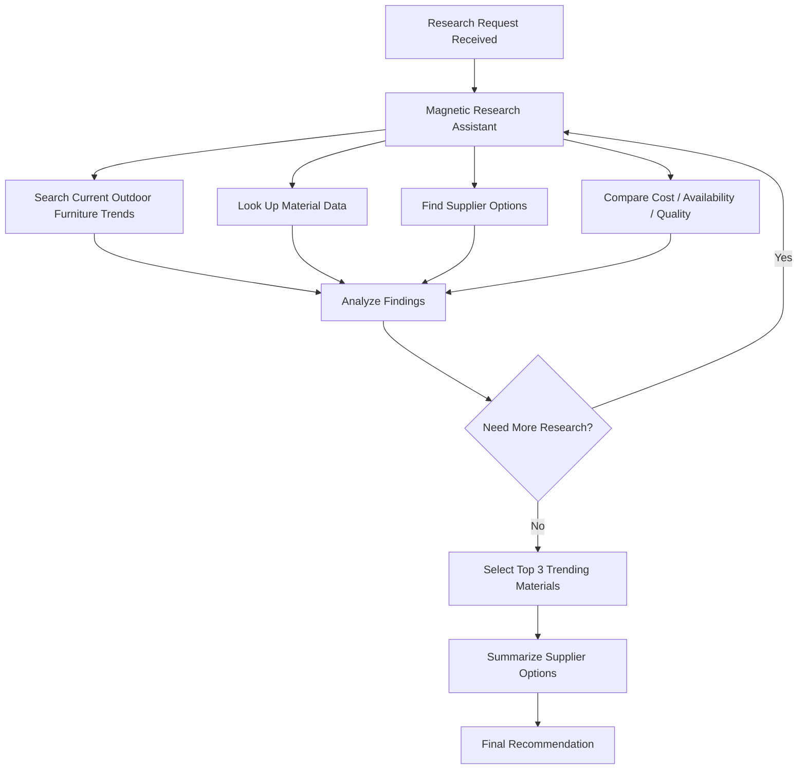
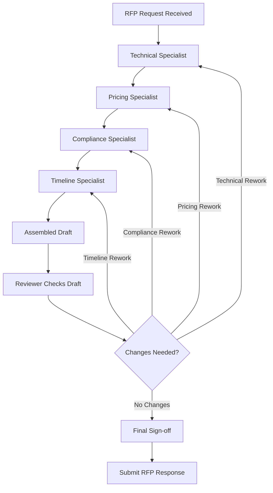

# Scenario 6 of 8 — Insurance: Claims Adjudication

## Question

A claim needs three independent checks:

Fraud screening → Policy-coverage check → Medical-coding review

These checks can run at the same time.

After that, a final decision agent combines all three results and decides:

Approve or Deny

**Pick the pattern you would use:**

- Round-robin
- Selector
- Swarm / Handoff
- GraphFlow
- Magnetic

---

## Answer: GraphFlow

## Runner-up: Swarm / Handoff

## Justification

I would choose **GraphFlow** because the process has a clear structure.

The claim goes into three parallel checks:

- Fraud screening
- Policy coverage check
- Medical coding review

After all three checks are completed, their results are joined together and sent to a final decision agent.

This is a fixed workflow with parallel branches and a final merge, so GraphFlow fits best.

---

## Why GraphFlow is best?

GraphFlow is best when:

- Steps are known in advance
- Some steps can run in parallel
- Results need to be combined later
- Final decision depends on outputs from multiple agents

This insurance process is not random or open-ended. It follows a clear path.

## Tentative Block Diagram

## Simple Flow

1. Claim is received.
2. Three checks start at the same time.
3. Fraud, coverage, and medical coding are reviewed separately.
4. Results are combined.
5. Final decision agent approves or denies the claim.

## Final Choice

**GraphFlow**

---

# Scenario 7 of 8 — Retail: Buyer’s Research Assistant

## Question

A merchandising team asks:

“Find three trending materials for outdoor furniture this season and summarise supplier options.”

The number and type of sub-tasks is not known in advance and may need:

Web search → Data lookups → Supplier research → Trend analysis → Summary

## Answer: Magnetic

## Runner-up: GraphFlow

## Justification

I would choose **Magnetic** because this is an open-ended research task.

The assistant does not know all steps in advance. It may first search trends, then check suppliers, then compare prices, then look for availability, and then summarize options.

The next action depends on what the assistant finds during research.

That is why **Magnetic** fits best.

---

## Why Magnetic is best?

Magnetic is best when:

- The task is research-based
- Steps are not fixed in advance
- The assistant may need multiple tools
- The assistant decides the next move based on findings
- The final answer is created after exploration

Here, the assistant needs to explore outdoor furniture trends and supplier options, so a dynamic pattern is needed.

---

## Tentative Block Diagram

## Simple Flow

1. Team asks for trending materials.
2. Assistant starts research.
3. It searches trends, suppliers, and data.
4. Based on results, it decides what to check next.
5. It repeats until enough information is collected.
6. Final answer gives three materials and supplier options.

## Final Choice

**Magnetic**

---

# Scenario 8 of 8 — Manufacturing: RFP Response Builder

## Question

A bid response has four sections:

Technical → Pricing → Compliance → Timeline

Each section is owned by a specialist and assembled in order.

A reviewer then checks the assembled draft and may send specific sections back for rework before final sign-off.

## Answer: GraphFlow

## Runner-up: Swarm / Handoff

## Justification

I would choose **GraphFlow** because the RFP response has a clear structured workflow.

The sections are known in advance, the order is mostly fixed, and there is a review step at the end. If something is wrong, only that specific section goes back for rework.

This fits GraphFlow because it supports:

- Fixed stages
- Multiple specialist steps
- Review checkpoints
- Conditional rework loops
- Final sign-off

---

## Why GraphFlow is best?

The process is not random. It follows a proper path:

1. Technical section is prepared.
2. Pricing section is prepared.
3. Compliance section is prepared.
4. Timeline section is prepared.
5. Reviewer checks the full draft.
6. Specific sections may go back for correction.
7. Final response is approved.

So GraphFlow is the best fit.

---
## Tentative Block Diagram

## Simple Flow

1. RFP request comes in.
2. Each specialist prepares their section.
3. Sections are assembled in order.
4. Reviewer checks the full draft.
5. If any section needs correction, it goes back to that specialist.
6. After corrections, reviewer signs off.
7. Final RFP response is submitted.

## Final Choice

**GraphFlow**
