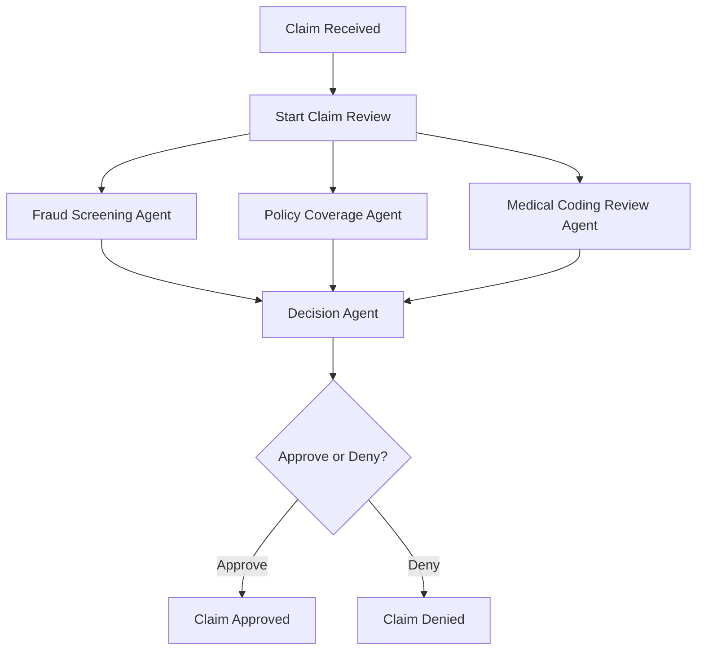
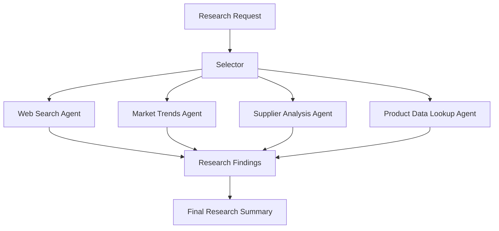
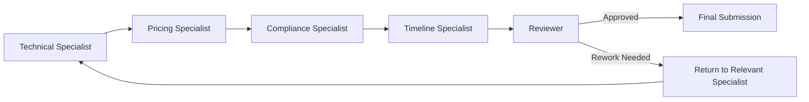

# Agent Pattern Scenarios

This note maps each scenario to a suitable multi-agent pattern and shows a simple block diagram for the proposed flow.

---

# Scenario 1: Claims Adjudication - Insurance

## Selected Pattern

**GraphFlow**

## Justification

GraphFlow fits this scenario because the workflow is clear and structured. The claim can be split into three independent checks:

- Fraud Screening Agent
- Policy Coverage Agent
- Medical Coding Review Agent

All three checks can run in parallel. Once they finish, their outputs are merged and passed to a Decision Agent. The final agent then approves or denies the claim.

This is a directed workflow with parallel branches and a single merge point, so GraphFlow is the best match.

## Block Diagram

## Final Choice

**GraphFlow**

---

# Scenario 2: Buyer's Research Assistant - Retail

## Selected Pattern

**Selector**

## Justification

Selector works well because the research request is flexible. The merchandising team may need trend research, supplier comparison, product data, or web search depending on the material being investigated.

The exact research path is not fixed at the beginning. A Selector can choose the most suitable agent or tool for each step:

- Web Search Agent
- Market Trends Agent
- Supplier Analysis Agent
- Product Data Lookup Agent

This keeps the workflow adaptable while still routing each subtask to the best available capability.

## Block Diagram

## Final Choice

**Selector**

---

# Scenario 3: RFP Response Builder - Manufacturing

## Selected Pattern

**Swarm / Handoff**

## Justification

Swarm / Handoff is suitable because different specialists own different parts of the RFP response:

- Technical section
- Pricing section
- Compliance section
- Timeline section

The work moves from one specialist to another, and the reviewer can send specific sections back for revision. The main interaction pattern is ownership transfer between agents, followed by review and possible rework.

This makes handoff more important than open-ended exploration or simple parallel execution.

## Block Diagram

## Final Choice

**Swarm / Handoff**
